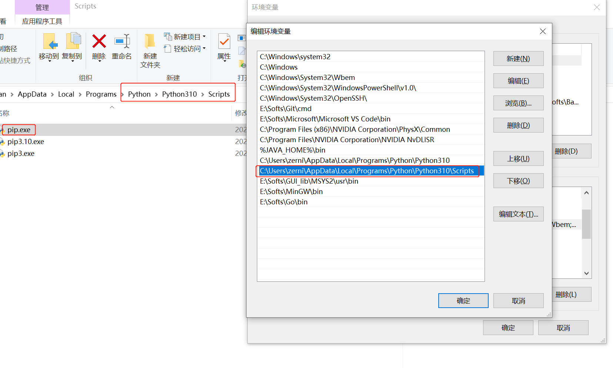
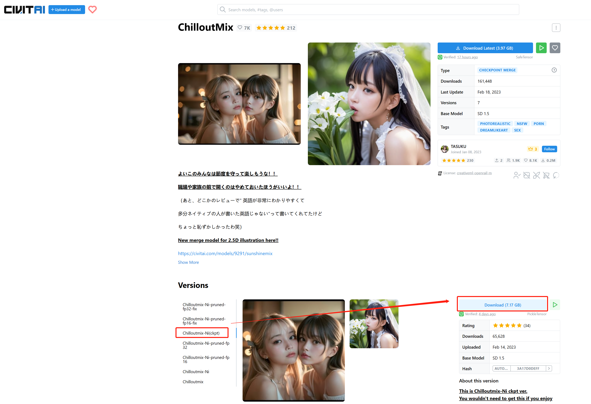
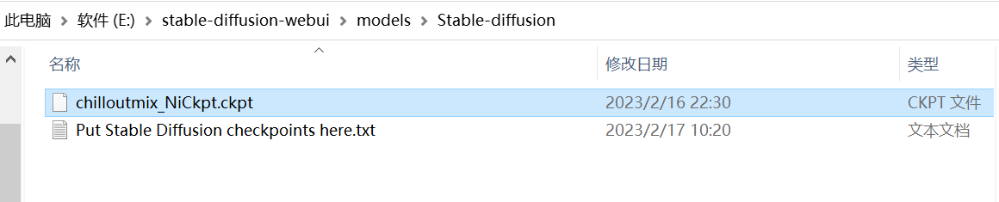
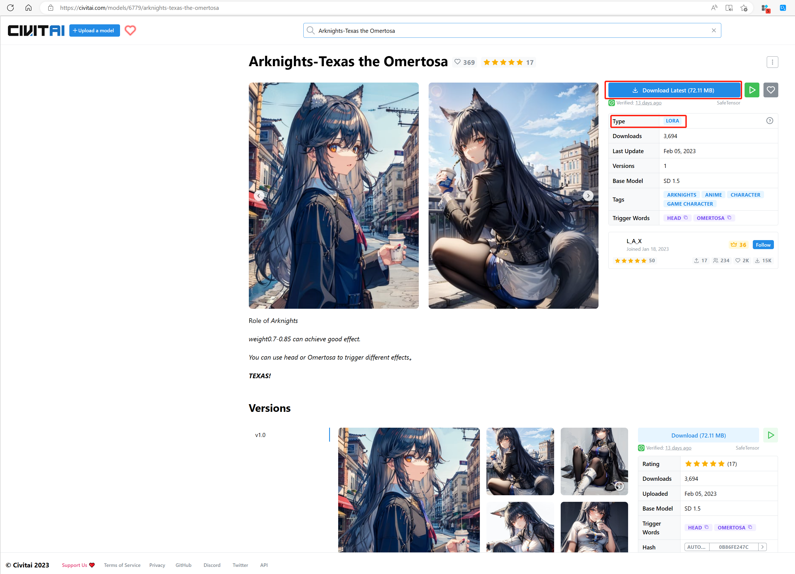
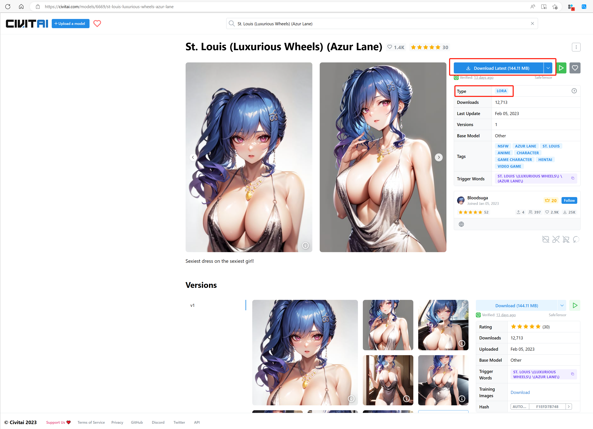
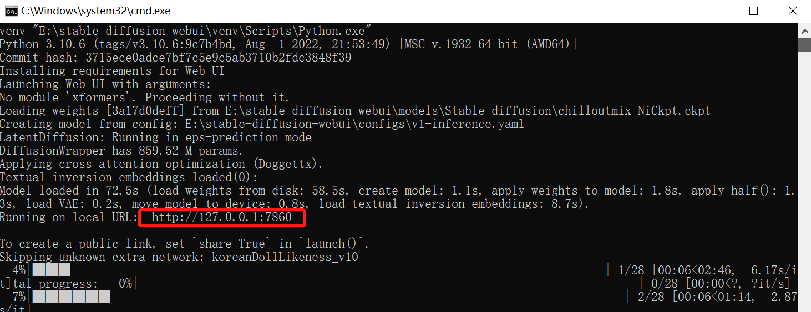

# 搭建SD离线AI绘画

git上关于SD的仓库有很多个，这里使用其中的webui，其它的我没有研究过

## 搭建之前需要配置一些环境（git、python）

关于怎么安装git跟python这里就不介绍了，不过有一些事项要强调一下

就是py的版本推荐是3.10.6，且需要支持pip
（其实不用额外安装pip，安装完python后在目录下/script是可以找到pip的，只需要将路径添加到环境变量PATH中即可）



## clone sd-webui仓库

```shell
git clone https://github.com/AUTOMATIC1111/stable-diffusion-webui.git
```

其实webui仓库的readme就有说明需要git跟python，建议先大概浏览一下它的**Installation and Running**部分

以它的window安装（Automatic Installation on Windows）说明为例，其中第四点:

> Place stable diffusion checkpoint (model.ckpt) in the models/Stable-diffusion directory (see dependencies for where to get it).
 
就是需要我们先下载好.ckpt文件放在已经拉取下来的webui仓库/models/Stable-diffusion路径下

## .ckpt文件以及.safetensors文件下载

相关文件我主要是在[civitai](https://civitai.com)下载

### chilloutmix_NiCkpt.ckpt下载

进入civitai搜索一下"ChilloutMix"就能找到这个ckpt文件了，注意下载的后缀，这个文件是7G



下载完将文件移动到上面提到的webui仓库目录/models/Stable-diffusion下



之后就可以执行剩下的第五点（Run `webui-user.bat` from Windows Explorer as normal, non-administrator, user.）

### .safetensors文件下载

启动需要时间，而且第一次启动还需要下载一些文件，可以顺便在civitai搜索一些.safetensors文件下载，这种文件相对前面的7G就要小得多

这里给出下载比较多的一个[KoreanDollLikeness](https://civitai.com/models/7448/korean-doll-likeness)


可以看到下载按钮下有个Type的属性，值是LORA（civitai上也有其他类型的文件，不过我没用过）

将下载好的koreanDollLikeness_v10.safetensors放到models/Lora目录下

之后等待脚本运行完毕即可，期间当然也可以多下载几个safetensors文件

### others

这里再介绍两个哈哈哈~~（夹带私货）~~

一个是最开始比较火的[明日方舟缄默德克萨斯](https://civitai.com/models/6779/arknights-texas-the-omertosa)



我一开始看到出图还以为是cos，震惊了，所以才决定要自己搭这个来玩玩(￣▽￣)ノ

下面这张是我搭完自己跑了一下**融合**出来的效果（~~黑丝o(≧∇≦o)~~），后面会提到怎么融合，不用急♪(´▽｀)


另一个是[碧蓝航线圣路易斯](https://civitai.com/models/6669/st-louis-luxurious-wheels-azur-lane)



这两个模型如果单独使用就只是二维的再创作，如果结合前面的KoreanDollLikeness以及ChilloutMix就可以实现惊人的真实效果

不过最后出图还是得看概率还有tag词条，弄不好也有出异形的可能，下面挑几张还不错的展示一下


~~（莫多莫多，我有营养快线）~~


银发也好好看呀


最后这个光影感真的好强，绝了

## 运行

脚本运行完毕启动后默认运行在7860端口，注意脚本不会自动打开浏览器



后面进度条一样的东西是开始了绘制任务后打印的，不用管

### tag格式说明

todo

### 融合

todo