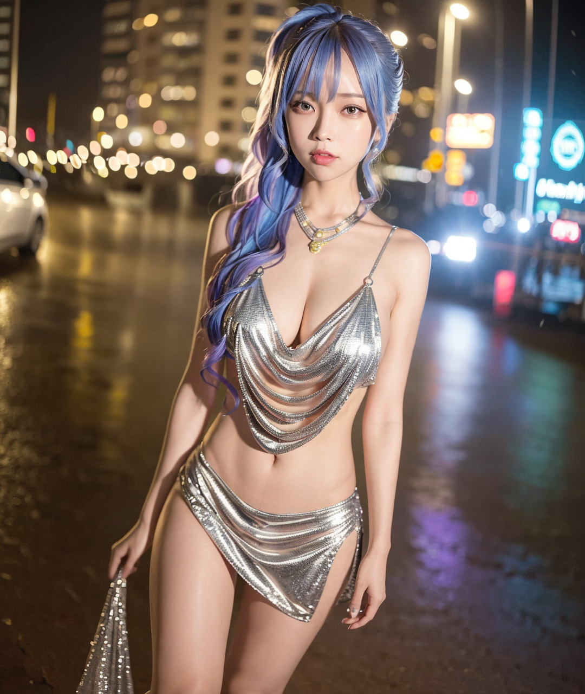
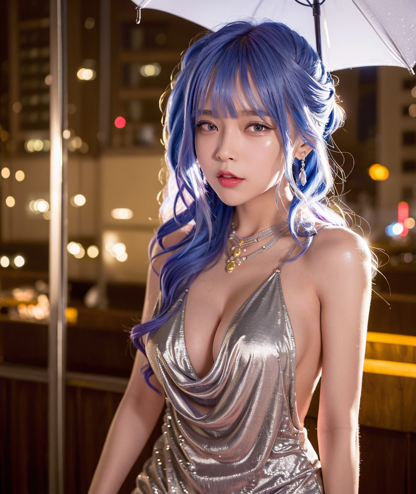

# 搭建SD离线AI绘画

git上关于SD的仓库有很多个，这里使用其中的webui，其它的我没有研究过

## 搭建之前需要配置一些环境（git、python）

关于怎么安装git跟python这里就不介绍了，不过有一些事项要强调一下

就是py的版本推荐是3.10.6，且需要支持pip
（其实不用额外安装pip，安装完python后在目录下/script是可以找到pip的，只需要将路径添加到环境变量PATH中即可）


## clone sd-webui仓库

```shell
git clone https://github.com/AUTOMATIC1111/stable-diffusion-webui.git
```

其实webui仓库的readme就有说明需要git跟python，建议先大概浏览一下它的**Installation and Running**部分

以它的window安装（Automatic Installation on Windows）说明为例，其中第四点:

> Place stable diffusion checkpoint (model.ckpt) in the models/Stable-diffusion directory (see dependencies for where to get it).
 
就是需要我们先下载好.ckpt文件放在已经拉取下来的webui仓库/models/Stable-diffusion路径下

## .ckpt文件以及.safetensors文件下载

相关文件我主要是在[civitai](https://civitai.com)下载

### chilloutmix_NiCkpt.ckpt下载

进入civitai搜索一下"ChilloutMix"就能找到这个ckpt文件了，注意下载的后缀，这个文件是7G


下载完将文件移动到上面提到的webui仓库目录/models/Stable-diffusion下


之后就可以执行剩下的第五点（Run `webui-user.bat` from Windows Explorer as normal, non-administrator, user.）

### .safetensors文件下载

启动需要时间，而且第一次启动还需要下载一些文件，可以顺便在civitai搜索一些.safetensors文件下载，这种文件相对前面的7G就要小得多

这里给出下载比较多的一个[KoreanDollLikeness](https://civitai.com/models/7448/korean-doll-likeness)


可以看到下载按钮下有个Type的属性，值是LORA（civitai上也有其他类型的文件，不过我没用过）

将下载好的koreanDollLikeness_v10.safetensors放到models/Lora目录下

之后等待脚本运行完毕即可，期间当然也可以多下载几个safetensors文件

### others

这里再介绍两个哈哈哈~~（夹带私货）~~

一个是最开始比较火的[明日方舟缄默德克萨斯](https://civitai.com/models/6779/arknights-texas-the-omertosa)


我一开始看到出图还以为是cos，震惊了，所以才决定要自己搭这个来玩玩(￣▽￣)ノ

下面这张是我搭完自己跑了一下**融合**出来的效果（~~黑丝o(≧∇≦o)~~），后面会提到怎么融合，不用急♪(´▽｀)


另一个是[碧蓝航线圣路易斯](https://civitai.com/models/6669/st-louis-luxurious-wheels-azur-lane)


这两个模型如果单独使用就只是二维的再创作，如果结合前面的KoreanDollLikeness以及ChilloutMix就可以实现惊人的真实效果

不过最后出图还是得看概率还有tag词条，弄不好也有出异形的可能，下面挑几张还不错的展示一下



~~（莫多莫多，我有营养快线）~~


银发也好好看呀



最后这个光影感真的好强，绝了

## 运行

脚本运行完毕启动后默认运行在7860端口，注意脚本不会自动打开浏览器


后面进度条一样的东西是开始了绘制任务后打印的，不用管

### 界面说明

在浏览器打开http://127.0.0.1:7860后基础界面如下


用得比较多的地方就是txt2img——文本生成图片，图片已经注释了一些常用功能的简要介绍

下面也简单提下自己运行时总结下来的一些小经验

+ Sampling method采样方法通常用的都是<u>DPM++ 2M Karras</u>或者<u>DPM++ SDE Karras</u>（至少civitai上分享出来的这两个比较多）
+ 图片尺寸在不使用Hires.fix的情况下，1000*1000左右就差不多了，再大很有可能多人融合异形，具体阈值还得看显卡跟内存吧
+ 使用Hires.fix的情况下可以尝试原图片大小400-500多左右的，有时候优化细节会有意想不到的惊喜
+ 测试了下CFG Scale设置为1，估计意思偏向提示词相关性
+ civitai上的图片基本无法复刻，即使什么配置（包括随机种子）都一样，只要图片大小也变化了一下生成结果也是千差万别，而且有的还可能使用了vae.safetensors（这个后面讲）

我倒是想生成2K的图片，但是稍微大一点经常异形，要么硬件配置不够（3060+3600MHz16G内存）

> OutOfMemoryError: CUDA out of memory. Tried to allocate 17.60 GiB (GPU 0; 12.00 GiB total capacity; 2.47 GiB already allocated; 6.50 GiB free; 2.49 GiB reserved in total by PyTorch) If reserved memory is >> allocated memory try setting max_split_size_mb to avoid fragmentation. See documentation for Memory Management and PYTORCH_CUDA_ALLOC_CONF
Time taken: 3.95sTorch active/reserved: 2592/2620 MiB, Sys VRAM: 12288/12288 MiB (100.0%)

### tag格式说明

tag关键词包括两个部分prompt（想要出现在图中的元素）与negative prompt（不想出现在图中的元素）

prompt通常还附带`<lora:xxx:1>`这样的格式，表示使用前面放在models/Lora目录下某个模型

例如`<lora:koreanDollLikeness_v10:0.5>`表示使用koreanDollLikeness这个模型，比重0.5，越高越接近koreanDollLikeness

当然这个需要自己提前下载好对应的文件并且路径名正确

还有别的格式，例如这个：`(photorealistic:1.4)`，翻译是照片真实感，那猜测是一些额外描述效果，并不是出现在图中的元素（这个就是个人猜测了）

最后注意就是多个关键词之间都用英文逗号分隔

### safetensors融合

知道了前面的`<lora:xxx:1>`tag之后这里应该很容易就知道怎么融合了，实际上就是使用多个`<lora:xxx:1>`

例如前面德克萨斯与圣路易斯，就是koreanDollLikeness与两个模型，加上一些场景要求（night、rain、cityscape等）分别融合的结果

copy civitai的示例参数时也有些要注意的细节


有的会使用txt2img+hires，有的仅使用txt2img

前者我尝试了自行下载图片，且调参数为下载图片尺寸的一半（因为hires会放大两倍），最后生成结果还是不一样

所以才说复刻不了，更多时候只需要参考别人的prompt就行啦

而官方koreanDollLikeness的示例prompt中应该是`<lora:koreanDollLikeness_v10:0.66>`

~~这个是因为那边在运行的时候基础模型就是koreanDollLikeness所以不需要加lora（我也不知道我瞎说的）~~

反正记住参数不是抄下来就能无脑用的

## 生成图片

前面prompt、negative prompt、图片尺寸、采样方法/步骤等参数设置完之后只需要点击**Generate**即可开始绘制，具体绘制时间就看硬件配置了

### vae.safetensors

关于vae我也是看到别人的说明，可以优化图片色彩啥的

下载地址：[huggingface-vae](https://huggingface.co/stabilityai/sd-vae-ft-mse-original/tree/main)

下载其中的`vae-ft-mse-840000-ema-pruned.safetensors`放到models/VAE下，之后在Settings/Stable Diffusion/SD VAE下拉选择该文件即可

如果是运行后下载且刷新没有生效的情况，关闭脚本重新运行再尝试就可以了


### 圣路易斯 prompt

最后补充一下前面的圣路易斯tag（其实也是civitai上copy的），当时设置的批量生成200张，最后跑了大概160分钟，产出正常的大概十几二十张

注：当时没有设置vae

prompt:
```text
(8k, RAW photo, best quality, masterpiece:1.2), (realistic, photo-realistic:1.37),<lora:koreanDollLikeness_v10:0.5>,st. louis \(luxurious wheels\) \(azur lane\),1girl,(Kpop idol), (aegyo sal:1),hair ornament, portrait, (long loose silver revealing dress:1.1), necklace, blue nails,cute,cityscape, night, rain, wet, professional lighting, photon mapping, radiosity, physically-based rendering, <lora:stLouisLuxuriousWheels_v1:1>
```

negative prompt:
```text
EasyNegative, paintings, sketches, (worst quality:2), (low quality:2), (normal quality:2), lowres, normal quality, ((monochrome)), ((grayscale)), skin spots, acnes, skin blemishes, age spot, glans,extra fingers,fewer fingers,
```

> Sampling method: DPM++ 2M Karras
> 
> Sampling steps: 20
> 
> Width: 1080
> 
> Height: 1280
> 
> Batch count: 50
> 
> Batch size: 4
> 
> CFG Scale: 7
> 
> Seed: -1